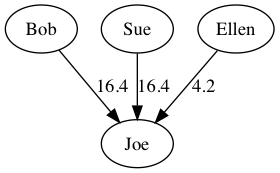

# Simplify-debts

Simplify debts by minimizing transactions. The algorithm does not aim in minimizing transaction amounts but only the number of transactions.

## Run

1. Create debts file, e.g. example.txt:
```
# Everyone owes Joe
* -> Joe: 16.80
Sue -> Joe: 24.40
Bob -> Sue: 12.20
# Ellen is part of everyone
Ellen
```

2. Run:
```
$ src/simplify.py <example.txt
Bob -> Joe: 16.4
Sue -> Joe: 16.4
Ellen -> Joe: 4.2
```

## Run with [graphviz](http://www.graphviz.org/)

```
$ src/simplify.py -g <example.txt |dot -Tpng >example.png
```



## Run tests

[Robot framework](http://robotframework.org/) required

```
$ cd test
$ pybot run-test.txt
```
